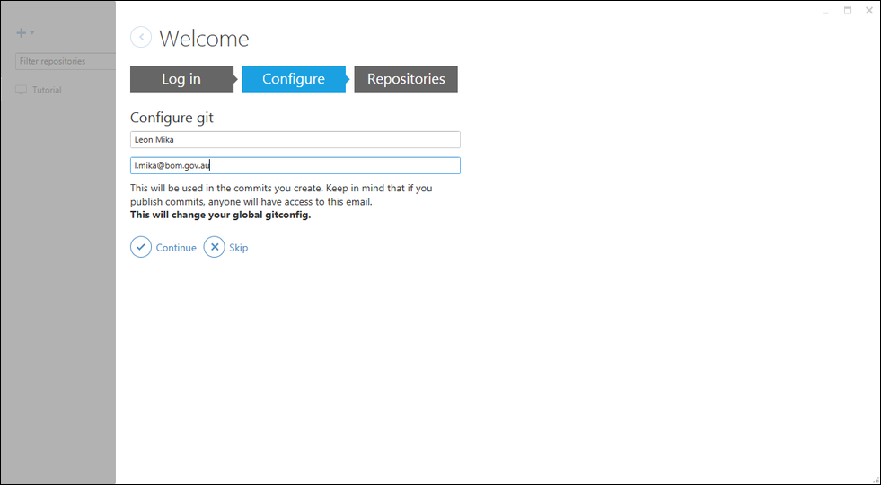
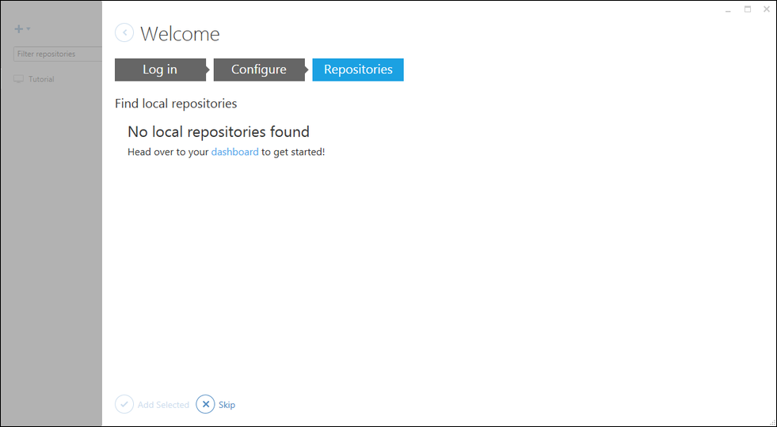
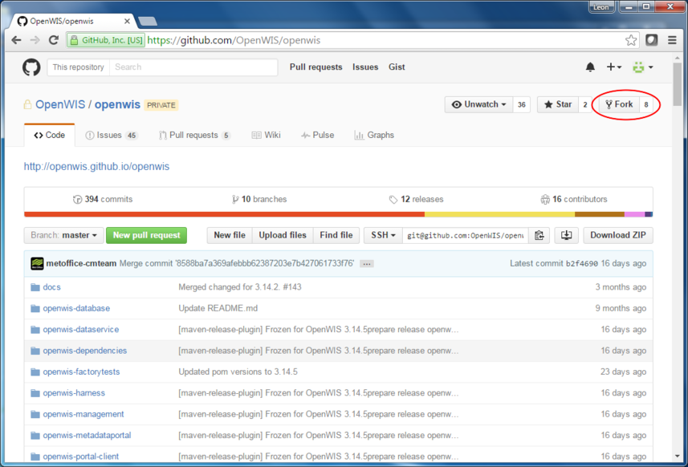
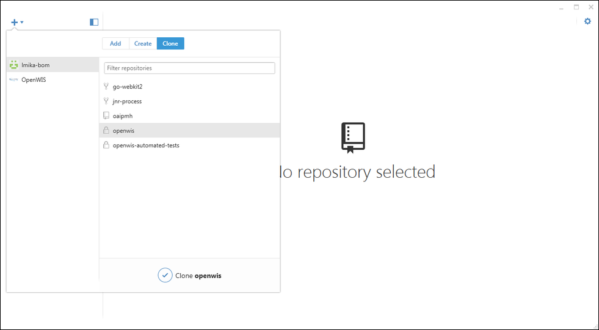
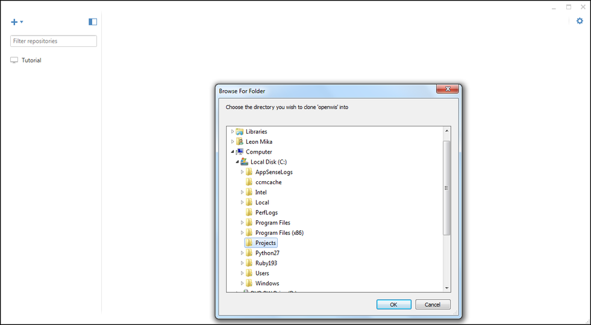
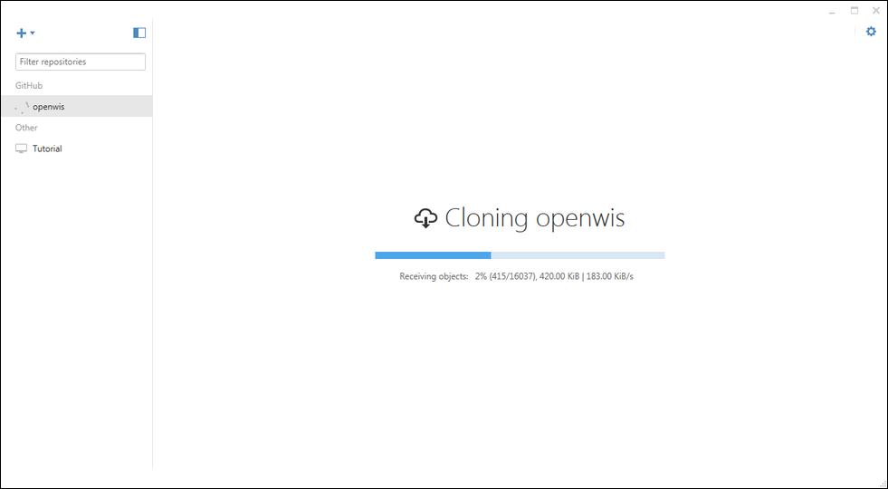
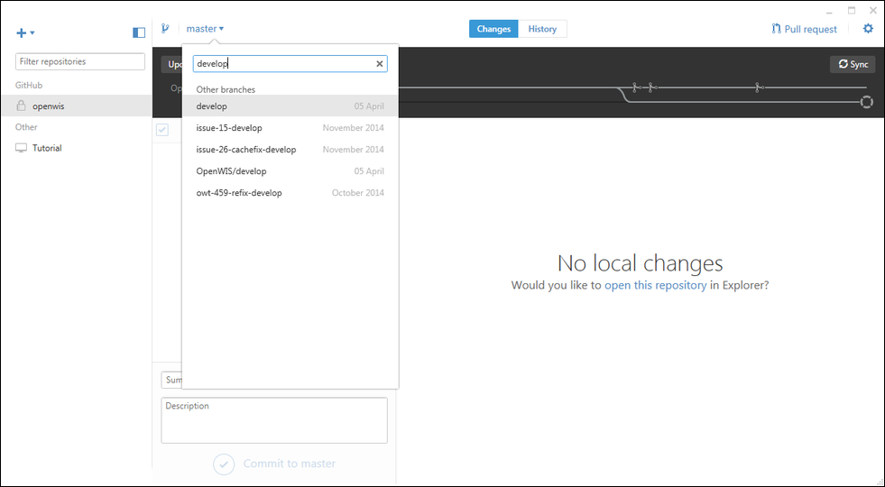

# Developer Platform Setup

This document will describe the process for setting up a development environment
in Windows and Linux.

## Windows

### Dependencies

You will need the following:

- [Java SE JDK](http://www.oracle.com/technetwork/java/javase/downloads/index.html): Oracle JDK 1.8
- [Eclipse](http://www.eclipse.org/downloads/packages/eclipse-ide-java-ee-developers/mars2): Latest version for Java EE Developers
- [Apache Maven 2.2.1](https://archive.apache.org/dist/maven/maven-2/2.2.1/binaries/apache-maven-2.2.1-bin.zip): Latest version of Maven 2
- [GitHub Desktop](https://desktop.github.com/): Latest version
- [VirtualBox](https://www.virtualbox.org/wiki/Downloads): Latest version
- [Vagrant](https://www.vagrantup.com/downloads.html): Latest version

#### Setup of a Tools Directory

Some tools require the use of the command line and setting of environment variables. Some difficulties may occur if
environment variables have values containing spaces. Therefore, for tools like Maven, it is suggested to install them
into a separate directory outside the "Program Files" directory. In this document, this directory will be called the
Tools directory, and will assume to be C:\Software.

1. Create the tools directory (e.g. C:\Software).

#### Installing The JDK

The latest of Oracle JDK is recommended due to the lack of an official Windows release of OpenJDK 1.7
or publicly available releases of Oracle JDK prior to the current release.

1. Download the Installer for the JDK from Oracle's website.  Run the installer.

2. Open up the file explorer and locate the install location of the JDK. It will probably be something
    like: C:\Program Files (x86)\Java\jdk1.8.0_91. Copy the path into the clipboard.

3. Go to the Control Panel and enter "Environment Variables" in the search box.
    Click "Edit environment variables for your account". Click "New..."

4. Enter `JAVA_HOME` as the environment variable name and the paste the path to the JDK as the value. Click "OK".

5. Look for an environment variable called `PATH`. Click "Edit..."

6. At the end of the value, add the following (note the semicolon): `;%JAVA_HOME%\bin`

#### Installing Apache Maven

Apache Maven is used as the build tool for OpenWIS. It does the same job as "make", but it allows for a more declarative method
of defining build-scripts, relying a lot on convention over configuration. It's a Java application so it requires Java to be
installed. The latest version of Maven is version 3, but OpenWIS currently only works on Maven 2.

1. Download the latest version of Maven 2

2. Unzip it into the Tools directory: e.g. `C:\Software\apache-maven-2.2.1`

3. Go to the Control Panel and enter "Environment Variables" in the search box.
    Click "Edit environment variables for your account".

4. Click "New..." to create a new environment variable. Enter the following values then click "OK".

    * Variable Name: `M2_HOME`
    * Variable Value: The directory Maven is installed to (e.g. C:\Software\apache-maven-2.2.1)
        
5. Create another new environment variable with the following values:

    * Variable Name: MAVEN_OPTS
    * Variable Value: -Xms256m -Xmx512m -XX:MaxPermSize=256m

6. Look for an environment variable called PATH. Click "Edit..."

7. At the end of the value, add the following (note the semicolon): `;%M2_HOME%\bin`

8. Closed the previously opened command window and open a new one. Type "mvn". You should see something like
    "BUILD FAILURE" and a lot of lines starting with "[INFO]". This means Maven is installed.

#### Installing GitHub Desktop

OpenWIS uses Git for code revision control, and GitHub as a code hosting platform.  Although it is possible
to use the Git command line tools, GitHub Desktop provides a simpler method for working with the code in Windows.

1. Run the installer for GitHub Desktop.  Keep all the defaults.

2. Login using your GitHub user account.

3. In the "Configure Git" screen, enter your name and email address.

    

4. In the "Repositories", press "Skip".

    

#### Installing Vagrant And VirtualBox

Vagrant is used to setup a virtual development environment for testing OpenWIS on your workstation.  It requires
a hypervisor to actually manage the virtual machine.  VirtualBox is recommended as it is a free hypervisor that
Vagrant supports out of the box.

1. Run the installer for VirtualBox.  Use the default settings.

2. Run the installer for Vagrant.  Use the default settings.

### Cloning The Repository

1. Open a browser and go to the [OpenWIS Github Project](https://github.com/OpenWIS/openwis).  You will need an account to access the OpenWIS code base.

2. Create a fork from OpenWIS by pressing the "Fork" button.  You should have a complete copy of the OpenWIS repository.

    

3. Open a command line and create a directory to contain the OpenWIS project code:

        C:\> cd c:\
        C:\> mkdir Projects

4. Open GitHub Desktop and click the plus button at the top-left ("Create, clone or add a local repository").

5. Click "Clone" and select your user-name in the list on the left.  Search for "openwis" on the right.  Click "Clone repository".

    

6. Locate the project directory to clone the repository into (e.g. "C:\Projects").

    

    Wait for the repository to be cloned.

    

7. Once the repository has been clone, switch to the `develop` branch.

    

### Initial Build

1. Perform an initial build of OpenWIS to confirm that the project was cloned correctly:

        C:\Projects\openwis> mvn clean exec:exec
        C:\Projects\openwis> mvn clean install -P openwis -Dfile.encoding=UTF-8
        C:\Projects\openwis> mvn clean install -P user -Dfile.encoding=UTF-8
        C:\Projects\openwis> mvn clean install -P admin -Dfile.encoding=UTF-8

  Each of the Maven projects should complete without error.

## Setting Up Eclipse

1. Open up Eclipse

2. Open up the Eclipse preferences and make the following changes:

    1. In "Java -> Compiler", set the JDK Compliance level to `1.7`.

3. Open the "Project" menu and turn off "Build Automatically".

4. Some additional plugins will need to be installed to cover Maven lifecycle goals.  Without then, the Eclipse project
   will have a number of build errors.   They are:

    - [cfx-codegen-plugin](https://github.com/ryansmith4/m2e-cxf-codegen-connector): Plugin to handle the Maven lifecycle
        plugin which generates Java code from SOAP WSDLs

    To install the plugins:

    1. Click the "Help" menu and select "Install New Software"

    2. In the "Work with" entry box, copy the following URL:

        <https://github.com/ryansmith4/m2e-cxf-codegen-connector.update/raw/master/org.eclipselabs.m2e.cxf.codegen.connector.update-site>

    3. Click "Next".

    4. Select all checkboxes in the tree and click "Next".

    5. Accept the licence and click "Finish".

    6. When asked about unsigned code, click "Yes".

    7. Finally, when asked to restart Eclipse, click "Yes".

### Importing The Project

1. Click "File -> Import" and select "Existing Maven Projects".  Click "Next".

2. Select the root directory of OpenWIS (e.g. "C:\Projects\openwis").  The list of projects will appear.

3. Click "Deselect all" and select the following projects:
    - openwis-management-client
    - openwis-management-service-common
    - openwis-management-service-ejb
    - openwis-management-service-ear
    - openwis-dataservice-common-utils
    - openwis-dataservice-common-domain
    - openwis-dataservice-common-timer
    - openwis-dataservice-cache-core
    - openwis-dataservice-cache-ejb
    - openwis-dataservice-cache-webapp
    - openwis-dataservice-server-ejb
    - openwis-dataservice-server-webapp
    - openwis-dataservice-server-ear
    - openwis-portal-client
    - cachingxslt
    - jeeves
    - oaipmh
    - sde
    - openwis-portal-solr
    - openwis-securityservice-war
    - PopulateLDAP
    - openwis-stagingpost
    - openwis-portal (openwis-metadataportal/openwis-portal)

4. Click "Next".

5. Select each imported project, except "openwis-portal", and right click.  Click the "Maven -> Select Maven Profile" menu item.

6. In the dialog box, select the "openwis" profile and click "OK".

7. Select the "openwis-portal" project and right click.  Click the "Maven -> Select Maven Profile" menu item.

8. In the dialog box, select the "user" profile and click "OK".

**NOTE**: You may still have some Eclipse errors due to the use of Maven 2.  Generally Eclipse is used mainly to edit code files.
The application is built from the command line.

## Building

1. To build the application, enter the following commands:

        C:\Projects\openwis> mvn clean install -P openwis -Dfile.encoding=UTF-8
        C:\Projects\openwis> mvn clean install -P user -Dfile.encoding=UTF-8
        C:\Projects\openwis> mvn clean install -P admin -Dfile.encoding=UTF-8

## Testing Using Vagrant

Vagrant commands must be executed in the OpenWIS project directory.

    1. Go to the OpenWIS project directory:

    2. Setup and start the Vagrant machines and OpenWIS by running the following command:

            C:\Projects\openwis> vagrant up

    Note that this may take a little while, especially when executed for the first time as
    Vagrant will need to download VM images from the internet.

    Vagrant Up will pick-up artefacts from the OpenWIS project file since the last Maven
    build.  Any other dependencies are either installed from the OpenWIS Cloudbees repository
    or from the OS repositories.

If necessary, a single machine can be brought up (or torn down) by adding the machine's
ID after the command.  OpenWIS is configured to run over 3 VM's, which have the following
ID:

* `db`: Database and Solr
* `data`: Data and management services, and staging post.
* `portals`: User portals.

Vagrant is configured to forward a number of ports to provide direct access to the services.
The set of forwarded ports is listed here:

Service | VM | Guest Post | Host Port
--------+----+------------+-----------
SSH | db | 22 | 2221
SSH | data | 22 | 2222
SSH | portals | 22 | 2223
Portal HTTP Frontend | portals | 8080 | 8060
JBoss SOAP | data | 8080 | 8061
PostgreSQL | db | 5432 | 8062
Solr | db | 8080 | 8063
JBoss Remote Debugging | data | 8787 | 8067
Portals Remote Debugging | portals | 8000 | 8068

Once Vagrant done, you will have an OpenWIS instance running locally.  You can then perform
the following operations.

#### Log Into the User Portal

1. To authenticate as "admin", follow this link: <http://localhost:8060/openwis-user-portal/srv/xml.user.login?username=admin&password=admin>

2. Bring up the home-page by going to <http://localhost:8060/openwis-user-portal/>

#### Log Into the Admin Portal

1. To authenticate as "admin", follow this link: <http://localhost:8060/openwis-admin-portal/srv/xml.user.login?username=admin&password=admin>

2. Bring up the home-page by going to <http://localhost:8060/openwis-admin-portal/>

#### Logging Into Backend

1. Enter `vagrant ssh <machine ID>` where machine is either `db`, `data` or `portals`.

2. Become the "openwis" user: `sudo -iu openwis`

#### Loading Test Data

1. In the OpenWIS project directory, go to the "load-test-data" project:

        C:\Projects\openwis> cd openwis-tools\load-test-data

2. Run `mvn -P openwis exec:java`

        C:\Projects\openwis\openwis-tools\load-test-data> mvn -P openwis exec:java

    Doing so will upload some metadata records and generate a bunch of GTS products.

#### Redeploy Without Rebuilding Environment

Due to the amount of time it takes to tear down and reprovision VMs, there are a couple of utility
scripts that can be use to redeploy some of the artefacts while Vagrant is running:

To redeploy the user/admin portals:

        C:\Projects\openwis> vagrant ssh portals -c '/vagrant/resources/vagrant/scripts/redeploy-portals.sh'

To redeploy the data/management services:

        C:\Projects\openwis> vagrant ssh data -c '/vagrant/resources/vagrant/scripts/redeploy-data-services.sh'

Note, for the portals, redeploying will reconfigure the application as it was when the VM was provisioned.

#### Tearing Down the Vagrant Environment

1. In the OpenWIS project directory, enter the following command:

        C:\Project\openwis> vagrant destroy

### Setting Up Remote Debugging In Eclipse

Vagrant is configured to allow remote debugging for the user portal, admin portal and data services.
The debugger can connect to the running applications from Eclipse.  To set this up:

1. Select "Run -> Debug Configurations..." from the drop-down menu.

2. Locate "Remote Java Application" on the list at the left.

3. Click "New launch configuration" near the top of the list.

4. Enter the following field values in the form on the right:

    - *Name*: Vagrant User Admin Portal
    - *Project*: Click "Browse" and select the "openwis-portal" project.
    - *Port*: 8068

6. Click "Apply".

7. Click "New launch configuration" again to setup remote debugging to the data services.  Repeat step 4 using the following values:

    - *Name*: Vagrant Data Services
    - *Project*: Click "Browse" and select the "openwis-management-service-ejb" project (the actual project may not matter.
            Eclipse should support debugging for any project in the workspace).
    - *Port*: 8067

8. Click "Apply".

9. Click "Close".

Now you can debug OpenWIS any time Vagrant is running.  To do so:

1. Click the drop-down arrow next to the bug in the tool-bar.

2. Select either "Vagrant User Admin Portal" to debug either the user or admin portal, or "Vagrant Data Services" to debug the
    data or management services (or both if necessary).

If all goes according to plan, you will be taken (or asked to be taken) to the Debug perspective, where you can use all of Eclipse's
debugging tools.